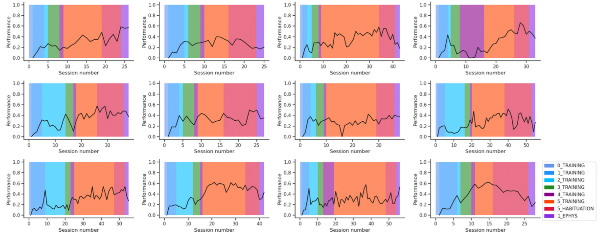
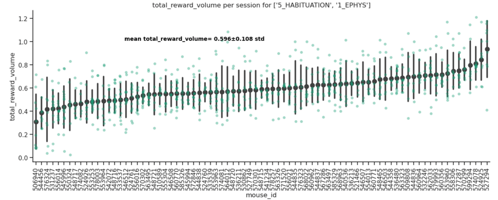
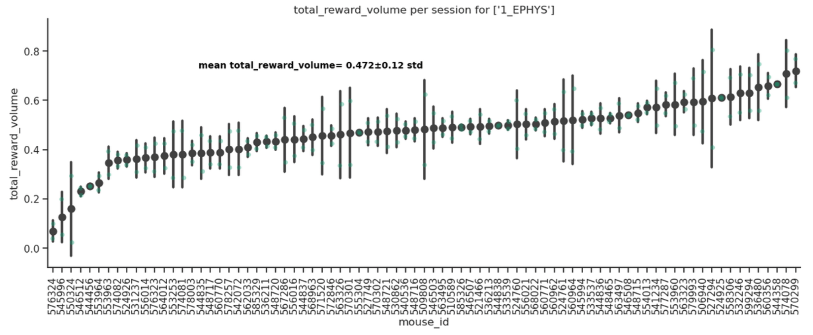
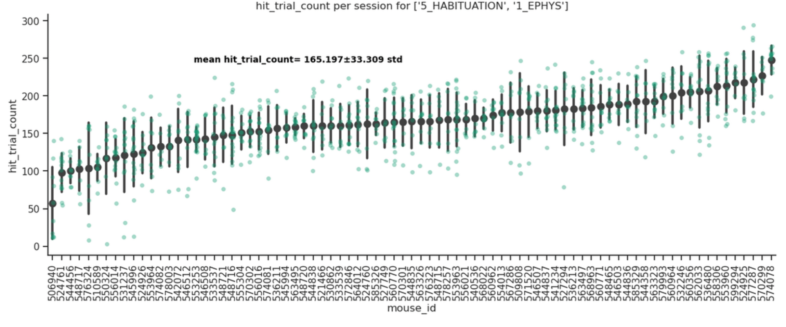
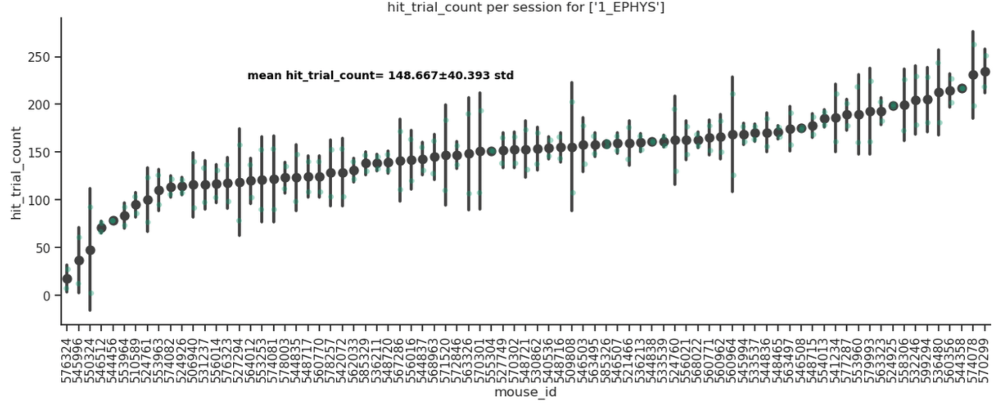
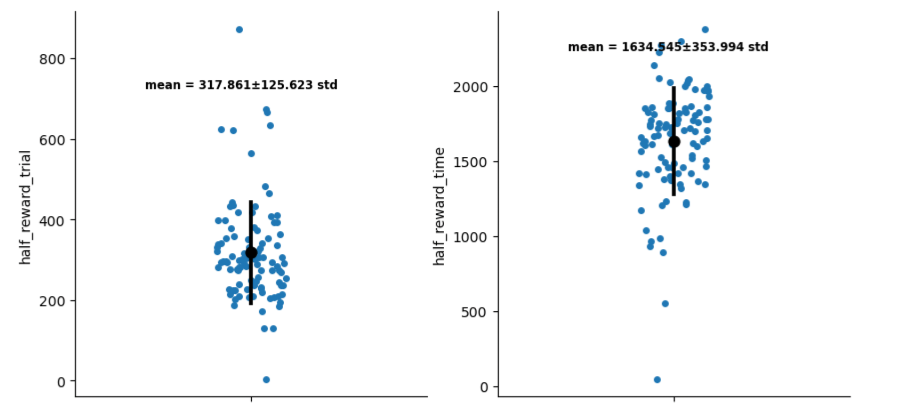
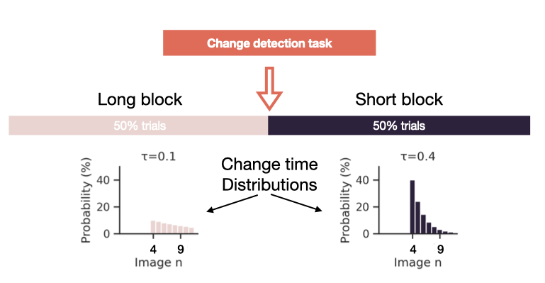

# Change detection task parameters

Our version of the change detection task (CDT) introduces two modifications:
*   2 CDT blocks within session separated by a break to allow injection
*  Each CDT block is further divided in two sections (short & long) in which the image changes are drawn from different distributions

#### Some parameters regarding these modifictions have to be optimized

1. Duration of the pre and post blocks
2. Duration of the short & long sections within each CDT

### 1. Duration of the pre and post blocks
Pre block should be 1268 s long. See calculations in "Duration of the pre and post blocks" --> "Option 2".
Ideally the post block should not have a predetermined end but should last until animal is engaged in the task.
### 2. Duration of the short & long sections within each CDT
With:

    tau_1 = 0.4
    tau_2 = 0.1

and a block of duration `X`. Time allocation between sections with different taus should be:

    T_tau2 = X / 1.776
    T_tau1 = 0.776 * (X / 1.776)

See "Duration of the short & long sections within each CDT" below.

## Duration of the pre and post blocks

The aim is to have similar performance/engagement between the two pre- post- injection blocks.
It is paramount that the mouse is not satiated after the 
first block, therefore not engaging in the task afterward. 

2 options are available:

*Currently option 2 is choosen.*

### Option 1
To ensure similar engagement we can look at the the mean reward amount or number 
of hit trials per session in the 
[visual-behavior-neuropixels dataset](https://portal.brain-map.org/circuits-behavior/visual-behavior-neuropixels)
and dynamically change the block duration contingent on the number of hit trials/rewards accumulated.

Training is structured in the following stages (12 example mice):

We compute the average reward per mouse during the last 2 stages of training:

or on recording days only:

We also compute the number of hit trials during the last 2 stages of training:

or on recording days only:

### Option 2

We can hardcode the duration of the blocks by looking at 
the mean time necessary to reach 50% of the total reward in each session. Analysis run 
on 153 session of the 
[visual-behavior-neuropixels dataset](https://portal.brain-map.org/circuits-behavior/visual-behavior-neuropixels), all recording sessions available, including sessions with abnormalities 
in either histology or recorded activity (`cache.get_ecephys_session_table(filter_abnormalities=False)`).

Let´s subtract 1 std from the mean to find a good empirical limit for the first repetition,
 either in number of trials:

311-120 = 191 trials

or seconds:

1631-363 = 1268 s

Given the use of different taus in the distributions to select image changes (long and short sections) the situation is more complicated. However, 
the duration of each sections is weighted to produce similar amounts of hit trials (assuming cnstant performance) the final effect should not deviate greatly (5%)
from the data analyzed here with one distribution with `tau = 0.3`.

## Duration of the short & long sections within each CDT

The aim here is to have the same number of hit trials in each section. We can expect the mice to 
collect more rewards in the section where image changes tend to happen earlier. We should adjust for this 
by reducing the duration of this section. First step here is to decide precisely the parameters of the 
distributions. From the proposal: *"The coefficient of the geometric distributions 
(change_time_scale) will be 0.1 and 0.4."*
Change times are selected from a truncated geometric distribution from 4 to 11 stimulus flashes after the trial start 
(in the Neuropixel Visual behavior the actual truncation is 4 to 11, not 5 to 11 as stated in the whitesheet).

To determine how much faster `tau_1` is compared to `tau_2`, we can use the ratio of the sum of `times` generated by the two distributions. Given that
 
    tau_1 = 0.4
    tau_2 = 0.1
    size = 1000  # Number of samples
    
    # Function to simulate truncated geometric distribution
    def truncated_geometric(tau, size, min_val, max_val):
        samples = []
        while len(samples) < size:
            sample = np.random.geometric(tau)
            if min_val <= sample <= max_val:
                samples.append(sample)
        return np.array(samples)
    
    # Simulate truncated geometric distributions
    truncated_dist_1 = truncated_geometric(tau_1, size, 4, 11)
    truncated_dist_2 = truncated_geometric(tau_2, size, 4, 11)
    
    # Convert number of flashes to time in milliseconds
    # Each image flash is 250 ms and followed by 500 ms of grey screen, total 750 ms per cycle
    times_1 = truncated_dist_1 * 750
    times_2 = truncated_dist_2 * 750
    sum(times_1) / sum(times_2) = 0.7761322789360172

it indicates that the average time for `tau_1 = 0.4` is approximately 77.6% of the average time for `tau_2 = 0.1`.

    Speed Increase = 1 / 0.7761322789360172 ≈ 1.288

This means that  `tau_1 = 0.4` is about 1.288 times faster `tau_2 = 0.1`.

If we have a block of duration `X`, and we assume stable performance we should allocate:

    T_tau2 = X / 1.776
    T_tau1 = 0.776 * (X / 1.776)

Using this balanced ratio the toatal amount of change times per duration X should be similar to the 
one used in the Visual Neuropixel dataset (5% difference)

